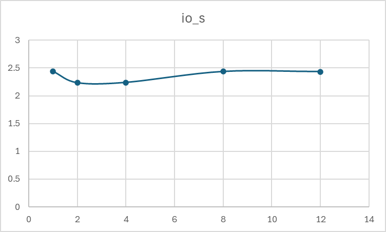
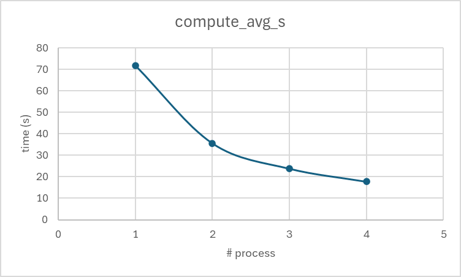
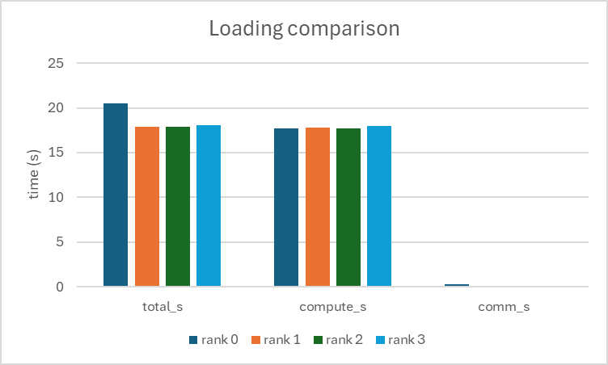

Parellel Programming HW2
===

<font size = 4>
<center>
113065508		黃為翰
</center>
</font>

## Implementation - A : Pthread

### 1. Allocate rows

- 影像是 width * height -> 第j列的開頭為image + j*width;
- 每一列由各thread獨佔write, 避免競爭
- 建立 `atomic<int> next_row{0}` 以及固定的chunk size `chunk=1`
    - 每次工作時，thread會用atomic operation去領走一個Task

``` cpp
int j0 = t->next_row->fetch_add(t->chunk, memory_order_relaxed);
if (j0 >= t->height) break;
int j1 = min(j0 + t->chunk, t->height);
for (int j = j0; j < j1; ++j) { ... }
```
- `fetch_add` 可以讓多thread不用使用mutex，哪個thread被抽到就給他做

### 2. Computation method

2.1 幾何映射
- 將畫面座標 (i, j) 對應到複數平面 `c = x0 + i * y`
``` cpp
dx = (right - left) / width
dy = (upper - lower) / height
y0 = lower + j * dy
x0(i) = left + i * dx
```

2.2 使用SSE2 vectorization
- 內層使用`for(i+=2)` 將兩像素一起計算，對應到一個2-lane的 `__m128`
    - 下面程式的 `select()` 是使用 `_mm_andnot_pd / _mm_or_pd` 來實作

``` cpp
active = (vrep < viter) & (vlen2 < 4.0)
if (movemask(active) == 0) break;
// z = z^2 + c：
xx     = vx*vx - vy*vy + vx0; // x'
xy     = vx*vy;
y_new  = 2*xy + vy0; // y'
len2   = xx*xx + y_new*y_new;

// 只有active的lane才會更新次數

vx     = select(active, xx,    vx);
vy     = select(active, y_new, vy);
vlen2  = select(active, len2,  vlen2);
vrep   = vrep + select(active, 1.0, 0.0);

```

2.3 寫回image的位置

- 在兩個像素都完成之後把vrep轉成int，一次寫回兩個位置
- 若width是奇數，最後一個像素會用純scalar的算法完成

``` cpp
const __m128i rep_i32 = _mm_cvtpd_epi32(vrep);
_mm_storel_epi64((__m128i*)(rowp + i), rep_i32);
```

## Implementation - B : Hybrid (openmp + mpi)

### 1. Allocate rows

1.1 : 
- 解析iters, left, right, lower, upper, width, height
- 建立buffer : `image(width*height)`
- 設定時間測量的變數 : `T_compute, T_comm, T_post, T_io, T_total`

1.2 : MPI allocation (round-robbin)
- 每個rank的掃描index為 : `j = rank + k * size` (k = 0, 1, 2 ...)
- 對應的local_rows : local_rows = `(height - 1 - rank + size) / size`
    - 每個rank 有一個local buffer : `local(local_rows * width)`

1.3 Root receive allocation
- rank0 為每個rank計算需回傳的像素數量 : `recvcounts[r] = rows_r * width`
    - `rows_r = height - 1 - r + size / size`


### 2. Calculation (OpenMP + SIMD)

2.1 : OpenMP parallization and Dynamic Allocation
- 進入 `#pragma omp parallel` 之後使用 `#pragma omp for schedule(dynamic)` 切分local row : jj in [0, local_rows]
    - `jj -> j_abs = rank + jj * size`
    - `y0 = lower + j_abs * dy`

2.2 SIMD Caclulation

- loop `for(i = 0; i+1 < width; i += 2)表示每步處理兩個像素i, i+1
    - x0 = left + i * dx, x1 = left + (i+1) * dx
- SIMD步驟
    - Whether keep interation : `active = (rep < iters && (len2 < 4.0))`
    - If active :
        - x_new = x*x - y*y + x0
        - y_new = 2*x*y + y0
        - len2new = x_new * x_new + y_new * y_new
        - rep = rep + 1
- 上面的步驟接使用 __m128來將兩個64-bit的double變成一個vector，如果有剩下單一像素的話，會在執行一次scalar的版本補齊

**implementation example**

``` cpp
    /*
        xx = x * x - y * y + x0;
        xy = x * y;
        y_new = 2 * xy + y0;
        x_new = xx ;
        len2new = x_new*x_new + y_new*y_new;
    */

    __m128d xx = _mm_sub_pd(_mm_mul_pd(vx, vx), _mm_mul_pd(vy, vy));
    xx = _mm_add_pd(xx, vx0);

    const __m128d xy      = _mm_mul_pd(vx, vy);
    const __m128d y_new   = _mm_add_pd(_mm_add_pd(xy, xy), vy0);
    const __m128d len2new = _mm_add_pd(_mm_mul_pd(xx, xx), _mm_mul_pd(y_new, y_new));
```


### 3. Integration

3.1 : Communication

- 每個rank都有自己的local buffer，內容是自己所有rows, 依照jj由小到大串接
- call 下面的Gatherv，由rank0把temp變成所有ranks的local依照rank順序拼接
``` cpp
MPI_Gatherv(local.data(), mycount, MPI_INT,
            tmp.data(), recvcounts.data(), displs.data(),
            MPI_INT, 0, MPI_COMM_WORLD);

```

3.2 Relallocation

- 因為本來分配的邏輯是round-robin : 所以每個rank的第k列對應的是global的j = r + k * size，所以需要把temp裡面的每段放到正確的位置

``` cpp
for (r in 0..size-1) {
    int rows_r = recvcounts[r]/width;
    for (k in 0..rows_r-1) {
        int j = r + k*size; // 絕對列
        memcpy(&image[j*width], &tmp[off + k*width], width*sizeof(int));
    }
    off += recvcounts[r];
}
```

最後就用wrtie_png輸出png圖片

## Evaluation

我使用的testcase為 strict35.txt
數據如下
``` cpp
ITERS  = 10000
LEFT   = -0.2931209325179713
RIGHT  = -0.2741427339562606
LOWER  = -0.6337125743279389
UPPER  = -0.6429654881215695
WIDTH  = 7680
HEIGHT = 4320
```

而我計算時間的方式如下：

利用下面的程式來計算cpu time以及thread time
``` cpp
static inline double wall_time_now(){
    struct timespec ts; clock_gettime(CLOCK_MONOTONIC, &ts);
    return ts.tv_sec + ts.tv_nsec * 1e-9;
}
static inline double thread_cpu_now(){
    struct timespec ts; clock_gettime(CLOCK_THREAD_CPUTIME_ID, &ts);
    return ts.tv_sec + ts.tv_nsec * 1e-9;
}
```

### Pthread

我固定Node = 1, 並改變thread的數量 (1, 2, 4, 8, 12)來比較使用不同數量的thread的差異

- 首先比較computation time在不同thread數量的表現


- 再來利用 time(#thread) / time(1 thread)的方式來看有多少倍的enhancement


- 而比較io_time的圖如下


藉由這些可以發現的是：實際上提升thread數量所造成的性能提升與預期的相距不大，而io_time的時間大致都是相同的。

- 接著在thread數量為12的狀況下比較每個thread的execution time

    

這張圖可以發現每一個thread的balance幾乎相同，也很符合預期

### Hybrid

在Hybrid version的evaluation的部分我是使用固定2個node以及6個thread，改變process的數量 (1, 2, 3, 4)來比較不同process數量之間的差異

- 比較不同process數量下的total time差異


- 比較不同process數量下的computation time差異


接下來比較在process = 4的狀況，每個process的loading差異




## Discussion

